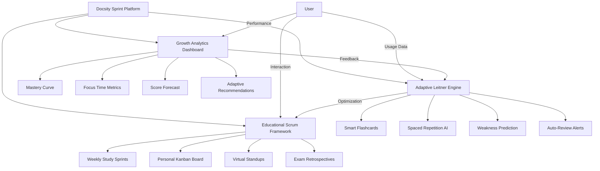

# Cover Letter - Product & Operations Lead at Docsity

Dear Hiring Team at Docsity,

I am writing to express my interest in the Product & Operations Lead position at Docsity. With over twelve years of experience in designing financial systems, executing algorithmic trading strategies, and managing fintech projects, I am confident in my ability to contribute effectively to your product development and operational success.

My background includes leading the architecture of a Python-based Decision Support System for real-time market-making, developing LSTM-based models for price trend forecasting, and managing cross-functional teams on data-driven trading initiatives. These projects - particularly GravityWaves, my AI-based forecasting platform - demonstrate my ability to translate market data into actionable product features with precision and strategic insight.

Though I am currently based in Iran, I am actively preparing for relocation to Italy, where my sister lives in Turin. Her presence provides a stable and supportive foundation for cultural and logistical integration, ensuring minimal disruption during onboarding. I view this relocation not as a challenge, but as an opportunity to bring global perspective, adaptability, and resilience to your team.

To provide clarity around my professional positioning, I offer the following overview of my candidacy:

| Strengths                                                  | Weaknesses                                              |
|-------------------------------------------------------------|----------------------------------------------------------|
| Extensive experience in algorithmic trading and product design | Lack of fluency in Italian (currently learning)          |
| Proven execution of AI-driven forecasting platforms         | Residency outside Italy requiring relocation             |
| Proficiency in Python, GitHub CLI, CI/CD automation         | Limited work experience in European markets              |

| Opportunities                                               | Threats                                                  |
|-------------------------------------------------------------|----------------------------------------------------------|
| Transfer of specialized insights from emerging markets       | Visa process and potential onboarding delays             |
| Family support in Turin enabling smooth transition           | Initial limitations in local networking and integration  |
| Contribution to Docsity’s AI and data-oriented projects      | Rapid adaptation expected within a dynamic work culture  |

### Turning Challenges into Strategic Advantages

- **Language**: I am actively investing in Italian language acquisition through daily practice and immersive learning resources.
- **Relocation logistics**: With my sister’s presence in Turin and structured planning underway, I expect a smooth transition to Italy.
- **Lack of EU experience**: My expertise in emerging markets provides a complementary viewpoint that enriches product strategy.
- **Networking**: I plan to accelerate integration into the Italian professional community with the help of personal and industry channels.

Docsity’s commitment to meaningful learning and data-powered innovation strongly aligns with my professional values. I am excited to contribute not only technical knowledge but also strategic leadership and international perspective to your team. Thank you for considering my application.

### Innovative Platform Development and Educational Planning

In addition to my technical expertise, I propose an innovative approach to platform development and educational planning that integrates advanced time management and project control systems with adaptive learning methodologies. This approach combines a growth analytics dashboard, an AI-powered Leitner system for personalized training, and Scrum-based lesson planning to optimize both product development and user learning outcomes.

Sincerely,  
**Shakour Alishahi**  
Email: shakouralishahi@gmail.com  
Phone: +98 912 446 7903  
GitHub: [Shakour-Data](https://github.com/Shakour-Data)
